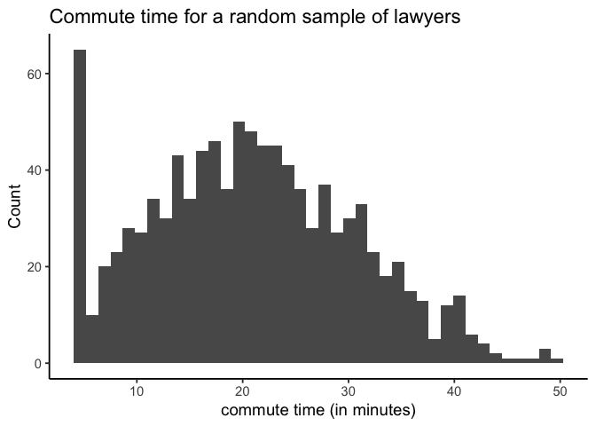
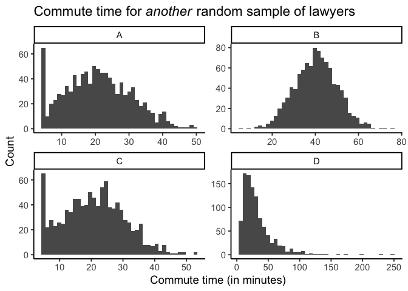

Q1: Another Random Sample
================

DeShawn is a lawyer. He works at a gigantic law firm with 100,000
lawyers. He was curious about the commute times of lawyers at his
company, so he randomly selected 1,000 lawyers, sent them a survey
asking them how long it takes them to get to work, and graphed the
results:

<!-- -->

DeShawn then took *another* random sample of 1000 lawyers at his
company, sent them the new survey, and graphed the new results.

**Which of the following graphs is most likely his new
results?**

<!-- -->
